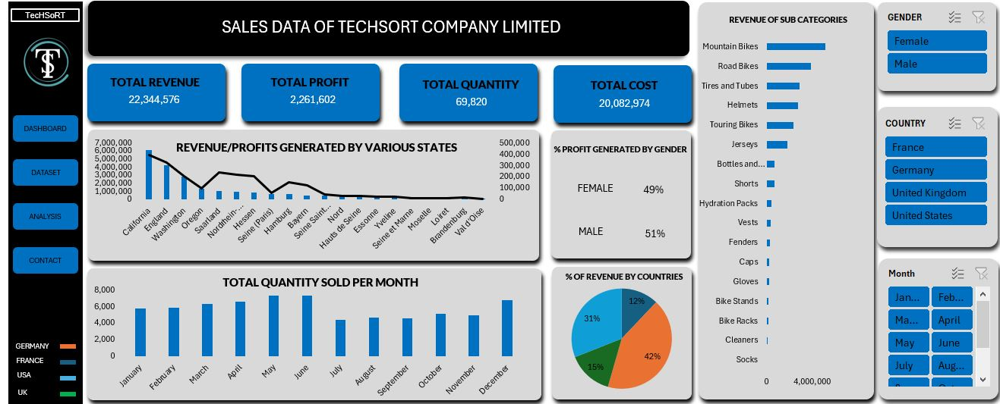
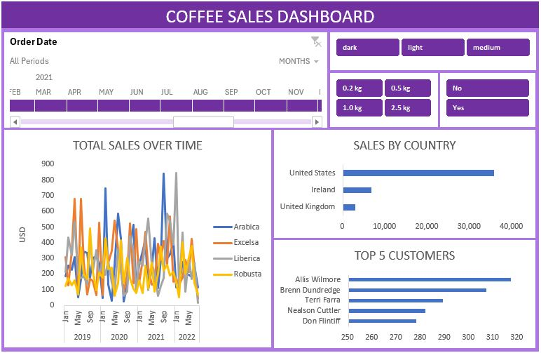
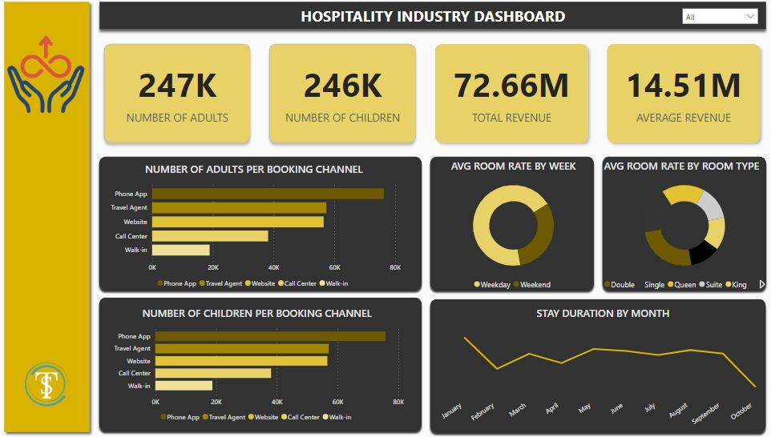
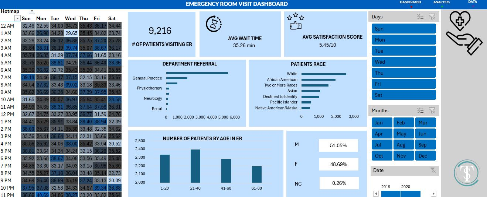

# DATA ANALYTICS PORTFOLIO

# Project 1

**Title:** [Sales Data Of Techsort Company Limited](https://github.com/Dennistheanalyst/dennistheanalyst.github.io/blob/main/sales%20project.xlsx)

**Tools Used:** Microsoft Excel (Power Query for data cleaning, Coditional Formating, Pivot Tables, Slicers, use of slicers, Pivot Charts, Timeline, shapes, Shape format)

**Project Description:** This project involved analysing sales data of a company to identify trends and patterns in sales performance for 2015 and 2016. It is designed to provide a comprehensive overview of key performance metrics. This dashboard allows stakeholders to easily monitor and analyze the company’s performance across different regions, states, and time periods. The dashboard includes the following features:

KPIs : 

Total Revenue : Total revenue generated by the company.

Total Profit : Total Profit made by the Company.

Total Cost : Sum of all expenses accrued by the company.

Total Quantity : Total number of goods produced by t he company.

Profit/Revenue by Country: Visual representation of profits and revenue broken down by each country.

Total Units Sold per Month: A monthly breakdown of the total units sold, providing insights into sales trends over time.

Profit/Revenue by Month: Displays the monthly profit and revenue, allowing for easy comparison of profitability throughout the year.

Total Revenue by Country and by various states: Highlights the total revenue generated in each country and states, showcasing the performance in different markets.

Additionally, the dashboard includes interactive slicers and timeline for:

Month: Filter the data to view performance for a specific month or range of months.

Country: Focus on specific countries to analyze regional performance.

Gender: Drill down into the performance of each gender.

**Key findings:** Regional Profitability: Identified the most profitable countries and highlighted regions where performance could be improved.

Seasonal Trends: Revealed patterns in sales and profit that correspond with seasonal events, allowing for more strategic planning.

Top-Performing Products: Highlighted which products are driving the most revenue and profit, aiding in inventory and marketing decisions.

Sales Volatility: Analyzed monthly sales fluctuations to understand market dynamics and adjust business strategies accordingly.

This dashboard serves as a crucial tool for the cookies company’s management team, providing clear, actionable insights that drive informed decision-making and strategic planning.

**Dashboard Overview:** 

# Project 2
**Title:** [Coffee Order Dashboard](coffeeOrdersData.xlsx)

**Tools Used:** Microsoft Excel (Excel Functions - if statement,xlookup,vlookup,index-match,remove duplicates, Pivot Tables, Slicers, use of slicers, Pivot Charts, Timeline, shapes, Shape format)

**Project Description:** This project provides an in-depth analysis of coffee sales data from a coffee company, offering valuable insights into sales performance, customer behavior, and regional market trends. The analysis focuses on identifying patterns in sales fluctuations over a given year, highlighting periods of growth and decline. Additionally, it examines regional sales distribution to determine which areas contribute the most to overall revenue.
A key aspect of this analysis is the identification of the top 5 customers who make the highest purchases, allowing for a better understanding of customer preferences and spending habits. This insight enables the company to optimize its marketing strategies and improve customer engagement.
Furthermore, the project explores the impact of loyalty cards in tracking customer behavior across different regions within a specific timeframe. The use of loyalty cards provides several business advantages, including:
      - Enhancing customer retention through personalized rewards and incentives.
      - Boosting sales and revenue by encouraging repeat purchases.
      - Improving customer experience and satisfaction through tailored promotions and exclusive offers.

**Dashboard Functionalities:**
Sales by Region – Analyzes total sales across different regions, identifying the top-performing locations and suggesting strategies to enhance sales in underperforming areas.

Top 5 Performing Customers – Highlights the highest-spending customers in various regions and by coffee type, helping businesses understand their most valuable clients and tailor promotional efforts accordingly.

Total Sales Over Time – Examines seasonal sales trends and time-based purchasing patterns, allowing businesses to develop short-term strategies to maximize revenue during peak seasons and improve performance during slow periods.

Total Sales Over Time – Examines seasonal sales trends and time-based purchasing patterns, allowing businesses to develop short-term strategies to maximize revenue during peak seasons and improve performance during slow periods.

This project serves as a data-driven decision-making tool, helping the coffee company refine its sales strategies, optimize marketing efforts, and improve overall business performance.

**Key findings:**

Seasonal Trends - Identified sales and profit trends that align with seasonal events and market cycles, providing valuable insights for strategic business planning. These findings help optimize inventory management, promotional campaigns, and resource allocation to maximize profitability during peak seasons and mitigate downturns during slower periods.

Top performing Countries - The United States remains the top-performing region, followed by Ireland and the United Kingdom over a four-year period. To sustain sales in top regions, strategies like personalized promotions, loyalty programs, and supply chain optimization should be implemented. For underperforming regions (e.g., the UK), targeted marketing, customer engagement initiatives, and expanded distribution channels are key to driving sales growth.

Sales Volatility - Conducted an in-depth analysis of monthly sales fluctuations to identify seasonal trends, demand patterns, and potential market shifts. These insights enable data-driven decision-making, allowing the business to optimize inventory management, refine marketing strategies, and adjust sales tactics to align with changing consumer behaviors and market conditions. 

**Dashboard Overview:** 

# Project 3

**Title:** [Hospitality Industry Dashboard](https://github.com/Dennistheanalyst/dennistheanalyst.github.io/blob/main/Hospitality%20industry%20project.pbix)

**Tools Used:** Power BI, Power Query, DAX functions, Charts, Shapes, Slicers.

**Project Description:** This project analyzed data from the hospitality sector to uncover trends and patterns in sales performance, guest stay durations by month, and the most popular booking channels. Additionally, it examined the demographic profile of visitors, including the count of children and adults throughout the year. The analysis also explored the average rates of different room types and the average rates by week.
It provides a detailed overview of essential performance metrics, enabling stakeholders to effectively track and assess the company’s performance across various metrics. The dashboard offers the following functionalities:

Number of Adults: The total count of adults who stayed at the hotel over the course of the year.

Number of Children: The total number of children who stayed at the hotel during the year.

Total Revenue: The overall revenue earned throughout the year.

Average Revenue: The yearly average revenue generated.

Number of Adults per booking Channel: Number of adults that uses various booking channels to book the hotel.

Number of Children Per Booking Channel: Number of Children that uses various booking channels to book the hotel.

Average Room Rate by week: Average price of the room by week be it weekend or weekday.

Average room rate by room type: The average rates of different room types offered at these hotels.

Stay Duration by month: This considers the length of time hotel patrons stay throughout the year.

Additionally, the dashboard includes interactive slicers and timeline for:

Months:  Filter the data to view performance for a specific month or range of months.

**Key findings:** Channel Optimization: Identifies key channels the company should prioritize to enhance customer service and improve performance across other booking channels.

Seasonal Patterns: Analyzes the months when customers tend to stay longer at the hotels, enabling the company to optimize profitability and deliver exceptional customer service.

Sales Volatility: Analyzed monthly sales fluctuations to understand market dynamics and adjust business strategies accordingly.

**Dashboard Overview:** 

# Project 4

**Title:** [Emergency Room Visit Dashboard](https://github.com/Dennistheanalyst/dennistheanalyst.github.io/blob/main/Hospital%20Emergency%20Room%20Visit%20Data.xlsx)

**Tools Used:** Microsoft Excel (Power Query for data cleaning, Coditional Formating, Pivot Tables, Slicers, use of slicers, Pivot Charts, Timeline, shapes, Shape format)

**Project Description:** This project examined hospital data to identify trends and patterns related to the daily patient stay durations in the emergency room over the course of a year, as visualized in a heat map. Furthermore, it analyzed the average patient satisfaction rates, as well as the distribution of patients based on age, gender, department referral, and race.
It gives a clear overview of key performance metrics, helping management monitor and evaluate how long patients wait in the emergency room. The dashboard offers the following functionalities:

Heatmap: That shows the stay duration of patients on a given day

Number of Patients Visiting the Emergency room.

Average Wait Time: The average amount of time a patient spends in the emergency room.

Average Satisfaction Score: This shows how satisfied patients feel after visiting the emergency room.

Department Referrals: The number of patients visiting a particular deopartment within a time period.

Patients' Race: The distribution of emergency room visits categorized by patients' race.

The distribution of emergency room visit categorised by age.

The distribution of Emergency room visit categorised by gender.

Additionally, the dashboard includes interactive slicers and timeline for:

Months/Days/Years: Apply filters to view the average wait time, the number of patients visiting the emergency room, and the average satisfaction score for a specific month, day, or year.

**Key findings:** Seasonal Patterns: Identifies the days when patients typically have longer stays, helping the hospital make provision for quality service by preparing for these peak periods.

**Dashboard Overview:** 

# Project 5
**Title:** Optimizing Retail Sales Insights: A SQL Data Analysis Project

**SQL Code:** [SQL Queries on Reatail Sales Data](retail_sales_sql)

This project showcases essential SQL skills and techniques commonly used by data analysts to explore, clean, and analyze retail sales data. It involves creating a retail sales database, conducting exploratory data analysis (EDA), and using SQL queries to answer key business questions. Designed for beginners in data analysis, this project helps build a strong foundation in SQL while providing hands-on experience with real-world data.

**Project Objectives**
            Retail Sales Database Setup – Create and populate a structured retail sales database using the provided dataset.
            Data Cleaning – Identify and handle missing or null values to ensure data accuracy and reliability.
            Exploratory Data Analysis (EDA) – Conduct basic analysis to understand key patterns, trends, and relationships within the dataset.
            Business Insights & Analysis – Utilize SQL queries to address specific business questions, extract meaningful insights, and support data-driven decision-making.

**Project Structure**

Data Exploration & Cleaning
      Record Count: Determine the total number of records in the dataset.
      Customer Count: Find out how many unique customers are in the dataset.
      Category Count: Identify all unique product categories in the dataset.
      Null Value Check: Check for any null values in the dataset and delete records with missing data.

Data Analysis and Findings
      Customer Demographics – The dataset features customers from diverse age groups, with purchases spanning various categories like Clothing and Beauty.
      High-Value Transactions – A significant number of transactions exceed $1,000, highlighting premium purchases.
      Sales Trends – Monthly sales analysis reveals fluctuations in demand, helping pinpoint peak seasons.
      Customer Insights – Identifies top-spending customers and the most popular product categories, providing valuable business intelligence.

Reports
      Sales Summary: A detailed report summarizing total sales, customer demographics, and category performance.
      Trend Analysis: Insights into sales trends across different months and shifts.
      Customer Insights: Reports on top customers and unique customer counts per category.

**SQL Code:** [SQL Queries on Reatail Sales Data](retail_sales_sql)

**SQL Skills Used:** 
Data Retrieval (SELECT): Queried and extracted specific information from the database.

Data Aggregation (SUM, COUNT): Performed calculations like totals for sales and quantities and counted records to identify data trends.

Data Filtering (WHERE, BETWEEN, IN, AND): Uses filters to select relevant data, such as specifying conditions, ranges, or lists.

Data Source Specification (FROM): Specified the tables used as data sources for retrieval

**Conclusion:**
This project offers a thorough introduction to SQL for aspiring data analysts, covering key areas such as database setup, data cleaning, exploratory data analysis (EDA), and business-focused SQL queries. The insights gained from this project provide valuable information on sales trends, customer behavior, and product performance, which can support informed business decision-making.

**Technology Used:** SQL server

# Project 6

**Title:** Interrogating data on Pizza

**SQL Code:** [SQL Querries on Pizza](https://github.com/Dennistheanalyst/dennistheanalyst.github.io/blob/main/Pizza.sql)

**SQL Skills Used:** 

Data Retrieval (SELECT): Queried and extracted specific information from the database.

Data Aggregation (SUM, COUNT): Performed calculations like totals for sales and quantities and counted records to identify data trends.

Data Filtering (WHERE, BETWEEN, IN, AND): Uses filters to select relevant data, such as specifying conditions, ranges, or lists.

Data Source Specification (FROM): Specified the tables used as data sources for retrieval

**Project Description:** This project analyzes company data to extract key information based on management's requests. It utilizes functions like COUNT and SUM to determine the total number of pizzas sold and ordered within a specific period. The SUM function is also applied to calculate the total revenue generated from pizza sales. Additionally, clauses such as WHERE, BETWEEN, IN, and WHEN are used to filter the data for specific products or product ranges as requested by the company.

**Technology used:** SQL server

